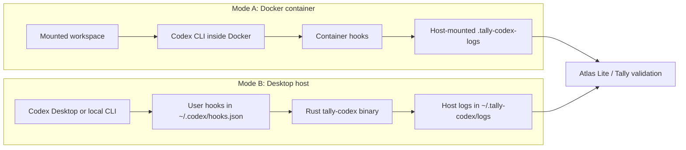

# Tally

A spec and standard for trustworthy agent interactions.

Tally includes a minimal Codex audit wrapper in two deployment modes:

- **Docker container mode** runs Codex inside a controlled container and writes
  hook logs to a host-mounted log directory.
- **Desktop host mode** keeps Codex running directly on the Mac, including
  Codex Desktop, and installs user-level hooks that write logs on the host.

Both modes use the same Rust binary, `tally-codex`, to capture Codex hook
events, write JSONL operational streams, emit Tally-style JSON records, tee
`codex exec` output when requested, and produce heartbeat records while a
session is active. The modes differ in where Codex runs and what security
boundary we can claim.

## Mode Overview

| Mode | Codex runs in | Hook installation | Default logs | Best for |
| --- | --- | --- | --- | --- |
| Docker container | Docker container | Container-owned `$CODEX_HOME/hooks.json` | `.tally-codex-logs/` in the mounted repo | Stronger packaging/control story; demos where the workspace mount is the boundary |
| Desktop host | Local Mac process | User-level `~/.codex/hooks.json` | `~/.tally-codex/logs/` | Codex Desktop UI and normal local Codex CLI workflows |



## Docker Container Mode

Use this when you want Codex, its hooks, and its runtime environment packaged
together. The container builds the shared Rust `tally-codex` binary, installs
Codex, copies a known hooks file into the container `CODEX_HOME`, and runs
Codex through `tally-codex wrap`.

```bash
docker compose -f codex-container/compose.yaml build
./codex-container/import-host-auth.sh
docker compose -f codex-container/compose.yaml run --rm \
  -e TALLY_RUN_ID=summary-demo \
  codex codex exec --json -s read-only \
  -c approval_policy='"never"' \
  "Summarize this repository in 5 bullets."
```

Logs appear under:

```text
.tally-codex-logs/                 # mounted container log root
```

See [codex-container/README.md](codex-container/README.md) for Docker-specific
commands, auth import, and controls.

## Desktop Host Mode

Use this when you want Codex Desktop or the local Codex CLI to keep running on
the Mac. The installer builds the same Rust `tally-codex` binary and merges
Tally hook handlers into `~/.codex/hooks.json`.

```bash
./codex-host/install-host-hooks.sh
```

Then use Codex Desktop normally. Logs appear under:

```text
~/.tally-codex/logs/
```

Useful checks:

```bash
cat ~/.tally-codex/logs/jsonl/codex-hooks.jsonl
cat ~/.tally-codex/logs/jsonl/hook-heartbeat.jsonl
find ~/.tally-codex/logs/tally -type f | sort
```

See [codex-host/README.md](codex-host/README.md) for Desktop install,
configuration, and uninstall commands.

## Log Contract

Both modes write the same broad categories:

- `jsonl/codex-hooks.jsonl`: hook events observed from Codex
- `jsonl/hook-heartbeat.jsonl`: immediate and periodic heartbeat events
- `tally/codex-hooks/*.json`: Tally-style session, instruction, action,
  result, lifecycle, and stop records
- `tally/hook-heartbeat/*.json`: heartbeat records
- `state/`: local state used by counters and heartbeat daemons

The Docker mode is the stronger packaging story because the hooks and Codex
runtime are delivered together in the container. The Desktop host mode is more
ergonomic for local UI use, but the user controls the host configuration and can
modify or remove hooks.

## Directory Map

```text
codex-audit/       # Rust source for the shared tally-codex binary
codex-container/   # Docker packaging, compose file, and container Codex config
codex-host/        # Desktop install/uninstall helper scripts
```
