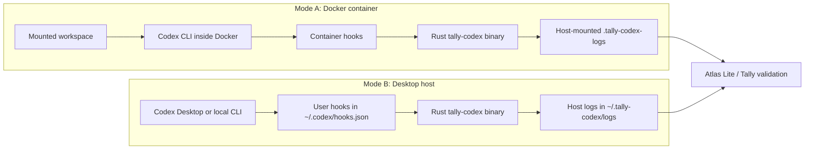
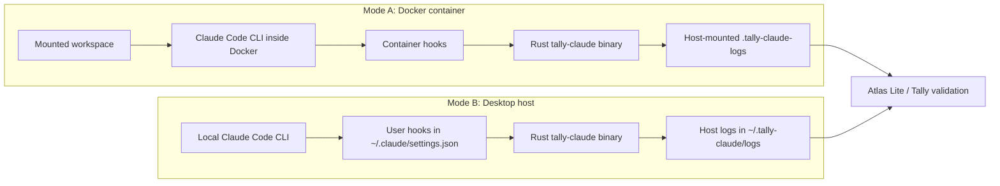

# Tally

A spec and standard for trustworthy agent interactions.

## Codex Audit Wrapper

Tally includes a minimal Codex audit wrapper with two deployment modes:

- **Docker container mode** runs Codex inside Docker and writes hook logs to a
  host-mounted log directory.
- **Desktop host mode** keeps Codex running directly on the Mac, including
  Codex Desktop, and installs user-level hooks that write logs on the host.

Both modes use the same Rust binary, `tally-codex`, to capture Codex hook
events, write JSONL streams, emit Tally-style JSON records, tee `codex exec`
output when requested, and produce heartbeat records while a session is active.

```text
codex-audit/       # Rust source for the shared tally-codex binary
codex-container/   # Docker packaging, compose file, and container Codex config
codex-host/        # Desktop install/uninstall helper scripts
```

## System Shape

| Mode | Codex runs in | Hook installation | Default logs | Best for |
| --- | --- | --- | --- | --- |
| Docker container | Docker container | Container-owned `$CODEX_HOME/hooks.json` | `.tally-codex-logs/` | Stronger packaging/control story; demos where the workspace mount is the boundary |
| Desktop host | Local Mac process | User-level `~/.codex/hooks.json` | `~/.tally-codex/logs/` | Codex Desktop UI and normal local Codex CLI workflows |



## Shared Rust Binary

Build locally:

```bash
cargo build --release --manifest-path codex-audit/Cargo.toml --bin tally-codex
```

Command surface:

```bash
tally-codex wrap [codex-args...]
tally-codex hook SessionStart
tally-codex heartbeat-daemon
tally-codex install-desktop-hooks
tally-codex uninstall-desktop-hooks
```

- `wrap` runs Codex and optionally tees `codex exec` stdout/stderr.
- `hook` reads a Codex hook payload from stdin and writes JSONL, private
  payload, Tally record, and heartbeat outputs.
- `heartbeat-daemon` emits periodic heartbeat records for the current run.
- `install-desktop-hooks` and `uninstall-desktop-hooks` manage user-level
  `~/.codex/hooks.json` entries.

## Docker Container Mode

Build:

```bash
docker compose -f codex-container/compose.yaml build
```

Run interactive Codex:

```bash
docker compose -f codex-container/compose.yaml run --rm codex
```

Run a read-only prompt:

```bash
docker compose -f codex-container/compose.yaml run --rm \
  -e TALLY_RUN_ID=summary-demo \
  codex codex exec --json -s read-only \
  -c approval_policy='"never"' \
  "Summarize this repository in 5 bullets."
```

Run an edit prompt using Docker as the workspace boundary:

```bash
docker compose -f codex-container/compose.yaml run --rm \
  -e TALLY_RUN_ID=edit-demo \
  codex codex exec --json -s danger-full-access \
  -c approval_policy='"never"' \
  "Create hello_from_codex.txt with one sentence."
```

`workspace-write` can fail inside Docker because Codex's inner filesystem
sandbox uses Linux namespace features that are often unavailable inside an
unprivileged container. With this wrapper, the mounted project directory is the
workspace boundary: only mount folders you want Codex to access.

Use this laptop's file-based Codex auth:

```bash
./codex-container/import-host-auth.sh
docker compose -f codex-container/compose.yaml run --rm codex codex login status
```

The auth import script copies the auth cache through stdin and does not print
token contents.

## Desktop Host Mode

Install hooks for Codex Desktop and the local Codex CLI:

```bash
./codex-host/install-host-hooks.sh
```

The installer builds:

```text
~/.tally-codex/bin/tally-codex
```

It backs up any existing `~/.codex/hooks.json`, removes older Tally hook
handlers, and merges in the current `tally-codex hook ...` handlers.

Use Codex Desktop normally after installation. If Codex asks you to review
hooks, trust the Tally hooks.

One-off local CLI smoke test:

```bash
codex --dangerously-bypass-hook-trust exec --json -s read-only \
  -c approval_policy='"never"' \
  "Respond exactly: host-hook-ok"
```

Uninstall:

```bash
./codex-host/uninstall-host-hooks.sh
```

## Logs

Docker mode writes logs under:

```text
.tally-codex-logs/
```

Desktop host mode writes logs under:

```text
~/.tally-codex/logs/
```

Log layout:

```text
jsonl/codex-hooks.jsonl       # hook events observed from Codex
jsonl/hook-heartbeat.jsonl    # immediate and periodic heartbeat events
private/                      # raw hook payloads by run/source
tally/codex-hooks/*.json      # Tally-style session/instruction/action/result records
tally/hook-heartbeat/*.json   # heartbeat records
state/                        # counters and heartbeat daemon state
codex-stdio/                  # stdout/stderr tee for `codex exec`
codex-native/                 # Codex's own diagnostics when enabled by config
```

Useful checks:

```bash
cat ~/.tally-codex/logs/jsonl/codex-hooks.jsonl
cat ~/.tally-codex/logs/jsonl/hook-heartbeat.jsonl
find ~/.tally-codex/logs/tally -type f | sort
```

## Controls

- `TALLY_RUN_ID` sets the run/session grouping key.
- `TALLY_LOG_ROOT` sets the log root.
- `TALLY_WORKSPACE` sets the workspace path used in metadata.
- `TALLY_HOOK_HEARTBEAT_ENABLED=0` disables hook-driven heartbeat records.
- `TALLY_HOOK_HEARTBEAT_SECONDS=60` controls the heartbeat interval.
- `TALLY_HOOK_HEARTBEAT_IDLE_SECONDS=300` stops heartbeat after hook inactivity.
- `TALLY_TEE_CODEX_STDIO=0` disables `codex exec` stdout/stderr teeing.
- `TALLY_BYPASS_HOOK_TRUST=0` stops Docker mode from adding
  `--dangerously-bypass-hook-trust`.
- `TALLY_OVERWRITE_CODEX_HOOKS=0` keeps an existing container
  `$CODEX_HOME/hooks.json`.
- `TALLY_OVERWRITE_CODEX_CONFIG=1` replaces an existing container
  `$CODEX_HOME/config.toml`.

## Security Notes

Docker mode is the stronger packaging story because Codex, the hook config, and
the `tally-codex` runtime are delivered together. The mounted workspace remains
the practical boundary, so mount only folders Codex should access.

Desktop host mode is more ergonomic for local UI use, but the user controls the
host configuration and can modify or remove hooks. Send `tally/` records through
Atlas or another independent anchor quickly if you need tamper evidence beyond
the local machine.

## Claude Code Audit Wrapper

Tally includes the same minimal audit wrapper for the Claude Code CLI, with the
same two deployment modes:

- **Docker container mode** runs Claude Code inside Docker and writes hook logs
  to a host-mounted log directory.
- **Desktop host mode** keeps Claude Code running directly on the Mac,
  including the Claude Code CLI's normal local workflow, and installs
  user-level hooks that write logs on the host.

Both modes use the same Rust binary, `tally-claude`, to capture Claude Code
hook events, write JSONL streams, emit Tally-style JSON records, tee `claude
-p` (print/non-interactive) output when requested, and produce heartbeat
records while a session is active.

```text
claude-audit/       # Rust source for the shared tally-claude binary
claude-container/   # Docker packaging, compose file, and container Claude Code config
claude-host/        # Desktop install/uninstall helper scripts
```

### System Shape

| Mode | Claude Code runs in | Hook installation | Default logs | Best for |
| --- | --- | --- | --- | --- |
| Docker container | Docker container | Container-owned `~/.claude/settings.json` | `.tally-claude-logs/` | Stronger packaging/control story; demos where the workspace mount is the boundary |
| Desktop host | Local Mac process | User-level `~/.claude/settings.json` | `~/.tally-claude/logs/` | Normal local Claude Code CLI workflows |



### Shared Rust Binary

Build locally:

```bash
cargo build --release --manifest-path claude-audit/Cargo.toml --bin tally-claude
```

Command surface:

```bash
tally-claude wrap [claude-args...]
tally-claude hook SessionStart
tally-claude heartbeat-daemon
tally-claude install-desktop-hooks
tally-claude uninstall-desktop-hooks
```

- `wrap` runs Claude Code and optionally tees `claude -p`/`--print` stdout/stderr.
- `hook` reads a Claude Code hook payload from stdin and writes JSONL, private
  payload, Tally record, and heartbeat outputs.
- `heartbeat-daemon` emits periodic heartbeat records for the current run.
- `install-desktop-hooks` and `uninstall-desktop-hooks` manage user-level
  `~/.claude/settings.json` hook entries (merging into the `hooks` key without
  touching any other settings already in that file).

Claude Code hooks share the same event names Codex uses (`SessionStart`,
`UserPromptSubmit`, `PreToolUse`, `PermissionRequest`, `PostToolUse`,
`PreCompact`, `PostCompact`, `SubagentStart`, `SubagentStop`, `Stop`), so the
wrapper maps each hook to the same OpenOrigins record types as the Codex
wrapper. Unlike Codex, Claude Code does not prompt the user to trust hooks
found in settings files, so `wrap` does not need to inject a
"bypass hook trust" flag.

### Docker Container Mode

Build:

```bash
docker compose -f claude-container/compose.yaml build
```

Run interactive Claude Code:

```bash
docker compose -f claude-container/compose.yaml run --rm claude
```

Run a read-only prompt:

```bash
docker compose -f claude-container/compose.yaml run --rm \
  -e TALLY_RUN_ID=summary-demo \
  claude claude -p "Summarize this repository in 5 bullets." \
  --permission-mode plan
```

Run an edit prompt using Docker as the workspace boundary:

```bash
docker compose -f claude-container/compose.yaml run --rm \
  -e TALLY_RUN_ID=edit-demo \
  claude claude -p "Create hello_from_claude.txt with one sentence." \
  --permission-mode bypassPermissions
```

With this wrapper, the mounted project directory is the workspace boundary:
only mount folders you want Claude Code to access.

The container image installs the Claude Code CLI via npm
(`@anthropic-ai/claude-code`), so it also ships a Node.js runtime alongside
the Rust `tally-claude` binary.

Use an API key for container auth:

```bash
docker compose -f claude-container/compose.yaml run --rm \
  -e ANTHROPIC_API_KEY=sk-ant-... \
  claude claude -p "Respond exactly: container-auth-ok"
```

Or reuse this laptop's existing Claude Code login session:

```bash
./claude-container/import-host-auth.sh
docker compose -f claude-container/compose.yaml run --rm claude claude -p "Respond exactly: host-auth-ok"
```

The auth import script copies `~/.claude.json` through stdin and does not
print token contents.

### Desktop Host Mode

Install hooks for the local Claude Code CLI:

```bash
./claude-host/install-host-hooks.sh
```

The installer builds:

```text
~/.tally-claude/bin/tally-claude
```

It backs up any existing `~/.claude/settings.json`, removes older Tally hook
handlers, and merges in the current `tally-claude hook ...` handlers.

Use Claude Code normally after installation.

One-off local CLI smoke test:

```bash
claude -p "Respond exactly: host-hook-ok" --permission-mode plan
```

Uninstall:

```bash
./claude-host/uninstall-host-hooks.sh
```

### Logs

Docker mode writes logs under:

```text
.tally-claude-logs/
```

Desktop host mode writes logs under:

```text
~/.tally-claude/logs/
```

Log layout:

```text
jsonl/claude-hooks.jsonl      # hook events observed from Claude Code
jsonl/hook-heartbeat.jsonl    # immediate and periodic heartbeat events
private/                      # raw hook payloads by run/source
tally/claude-hooks/*.json     # Tally-style session/instruction/action/result records
tally/hook-heartbeat/*.json   # heartbeat records
state/                        # counters and heartbeat daemon state
claude-stdio/                 # stdout/stderr tee for `claude -p`
```

Useful checks:

```bash
cat ~/.tally-claude/logs/jsonl/claude-hooks.jsonl
cat ~/.tally-claude/logs/jsonl/hook-heartbeat.jsonl
find ~/.tally-claude/logs/tally -type f | sort
```

### Controls

- `TALLY_RUN_ID` sets the run/session grouping key.
- `TALLY_LOG_ROOT` sets the log root.
- `TALLY_WORKSPACE` sets the workspace path used in metadata.
- `TALLY_HOOK_HEARTBEAT_ENABLED=0` disables hook-driven heartbeat records.
- `TALLY_HOOK_HEARTBEAT_SECONDS=60` controls the heartbeat interval.
- `TALLY_HOOK_HEARTBEAT_IDLE_SECONDS=300` stops heartbeat after hook inactivity.
- `TALLY_TEE_CLAUDE_STDIO=0` disables `claude -p` stdout/stderr teeing.
- `TALLY_OVERWRITE_CLAUDE_HOOKS=0` stops the container entrypoint from
  re-running the hook merge on every start.
- `TALLY_CLAUDE_SETTINGS_PATH` overrides the `settings.json` path that
  `install-desktop-hooks`/`uninstall-desktop-hooks` target (defaults to
  `~/.claude/settings.json`).
- `TALLY_CLAUDE_BIN` overrides where `claude-host/*.sh` build and look for the
  `tally-claude` binary (defaults to `~/.tally-claude/bin/tally-claude`).

### Security Notes

Docker mode is the stronger packaging story because the Claude Code CLI, the
hook config, and the `tally-claude` runtime are delivered together. The
mounted workspace remains the practical boundary, so mount only folders
Claude Code should access.

Desktop host mode is more ergonomic for local CLI use, but the user controls
the host configuration and can modify or remove hooks. Send `tally/` records
through Atlas or another independent anchor quickly if you need tamper
evidence beyond the local machine.
