# OpenOrigins Account Setup Guide

This guide walks you through creating an OpenOrigins account, completing the Tally Setup wizard, connecting your AI client, and verifying that agent logs are successfully ingested.

---

## Prerequisites

Before you begin, ensure you have:

- A valid work email address
- Access to your email inbox
- A supported AI client (Claude Code or Codex)
- A payment method (required for card verification, including the Free plan)

---

# Step 1 – Create an Account

Navigate to the OpenOrigins registration page and complete the following fields:

- Organisation Name
- First Name
- Last Name
- Work Email

Click **Create account**.

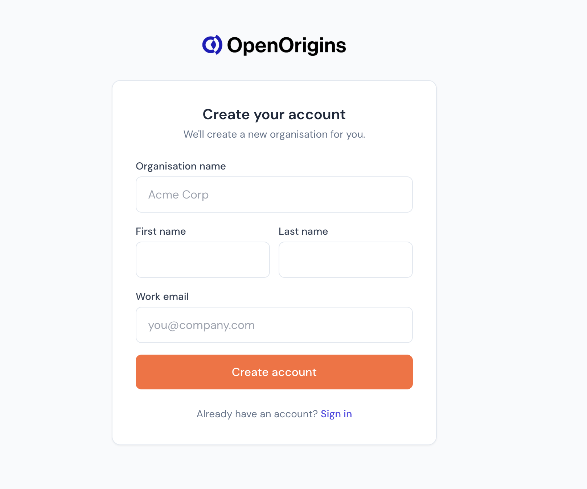

> **Note**
> A temporary password will be sent to the email address you provide.

---

# Step 2 – Check Your Email

After registration, you'll receive an email containing:

- Temporary password
- Login instructions

If you don't receive the email within a few minutes, check your Spam or Junk folder.

---

# Step 3 – Sign In

Return to the login page and enter:

- **Email** – the email used during registration
- **Password** – the temporary password from your email

Click **Login**.

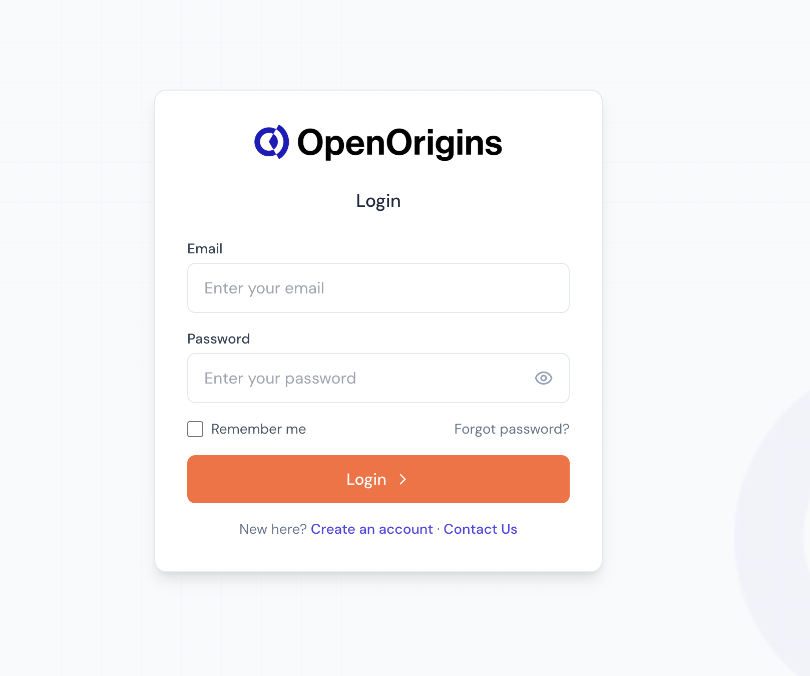

---

# Step 4 – Create Your Password

On the password setup screen:

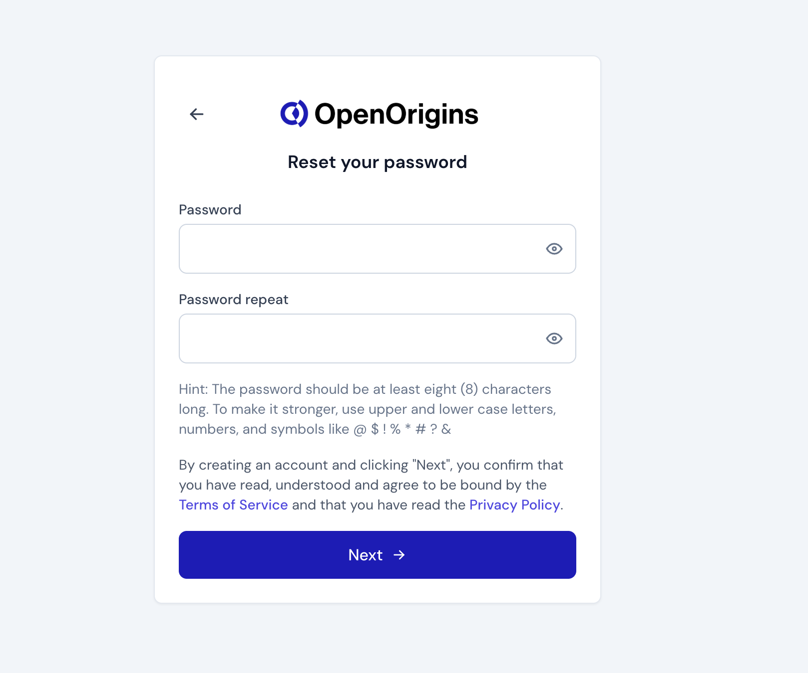

1. Enter a new password.
2. Confirm your password.
3. Review the:
    - Terms of Service
    - Privacy Policy
4. Click **Next**.

Your password must:

- Be at least 8 characters long
- Use a combination of:
    - Uppercase letters
    - Lowercase letters
    - Numbers
    - Symbols (recommended)

Clicking **Next** confirms acceptance of the Terms of Service and Privacy Policy.

After completion, you'll be redirected into the onboarding dashboard.

---

# Tally Setup Wizard

The onboarding wizard consists of four steps:

1. Billing
2. Connect
3. First Logs
4. Find Logs

A progress bar tracks your completion.

---

# Step 5 – Billing

Choose one of the available plans.

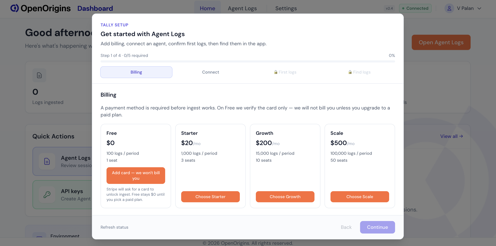


>Important
> 
>A payment method is required before log ingestion can begin.
For the **Free** plan:
>- Your card is **verified only**
>- You are **not charged**
>- Charges occur only if you upgrade
>Complete payment using Stripe via:
>- Card
>- Apple Pay
>- Link
>- Bank transfer (region dependent)

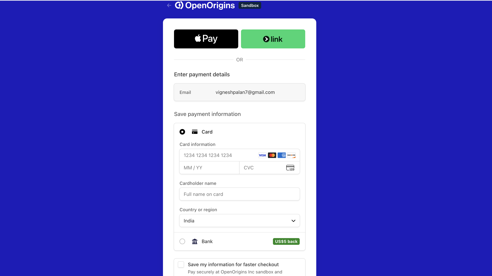

Once complete, the Billing step is automatically marked complete.

---

# Step 6 – Connect Your Client

Open the **Connect** tab.

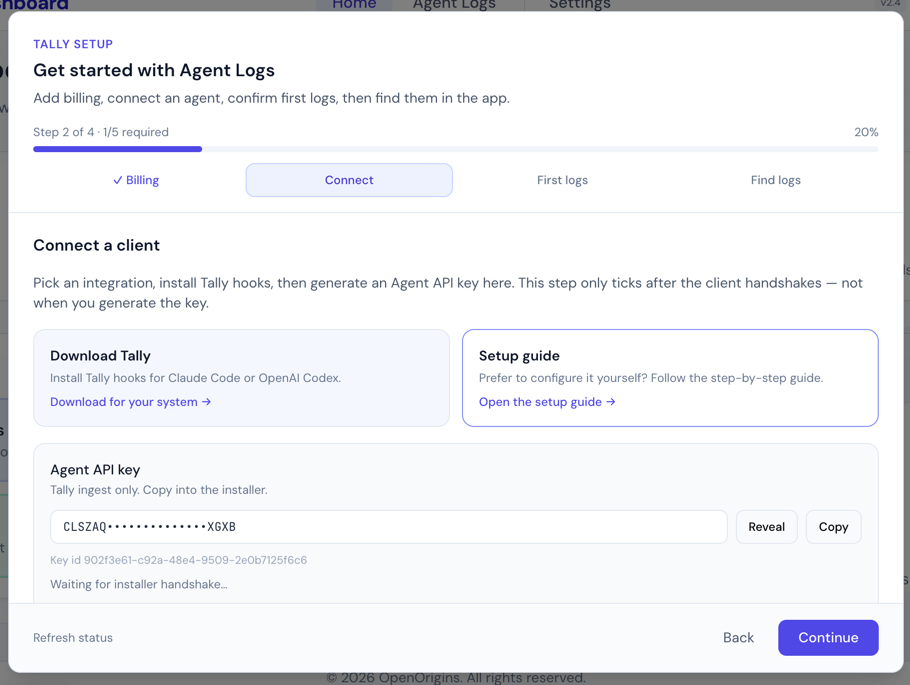

## Generate an Agent API Key

Click:

**Generate key**

Copy and save your Agent API key.

---

## Download and Install Tally

In the **Download Tally** card, click **Download for your system**. This opens the Tally **releases page**. Download the one Tally installer for your operating system; the same installer supports Claude Code and Codex.

Prefer to configure it yourself? Use the **Setup guide** card and click **Open the setup guide**.

Open the installer, select Claude Code, Codex, or both, paste the Agent API key, and select **Install Tally**.

### Expected Result

The installer will:

- Install Tally hooks into your client
- Back up existing configuration files
- Securely store your Agent API key
- Verify connectivity with the OpenOrigins ingest API

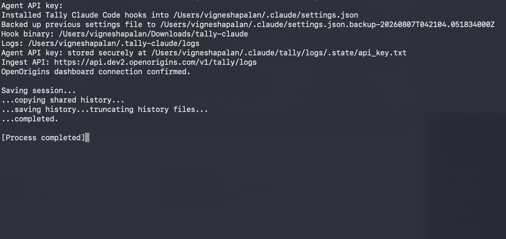

> **Important**
>
> Generating an API key alone does **not** complete this step.
>
> The installer must successfully perform a handshake with OpenOrigins.
>
> Once successful, the dashboard displays:
>
> **Agent connected**
>
> and the step is marked complete.

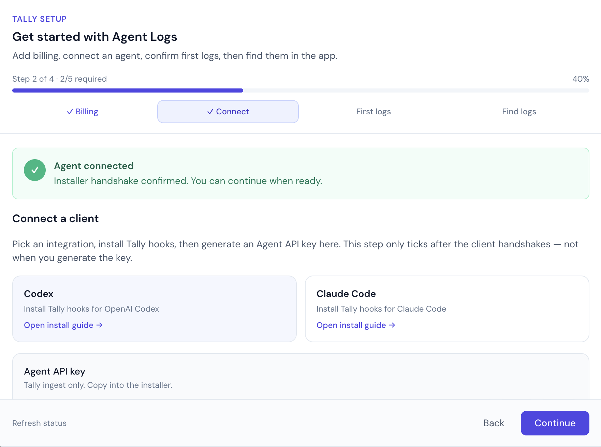

---

# Step 7 – First Logs

Open the **First Logs** tab.

You'll see a **Live log status** panel.

Initially, it displays:

```
Waiting for first ingest…
```

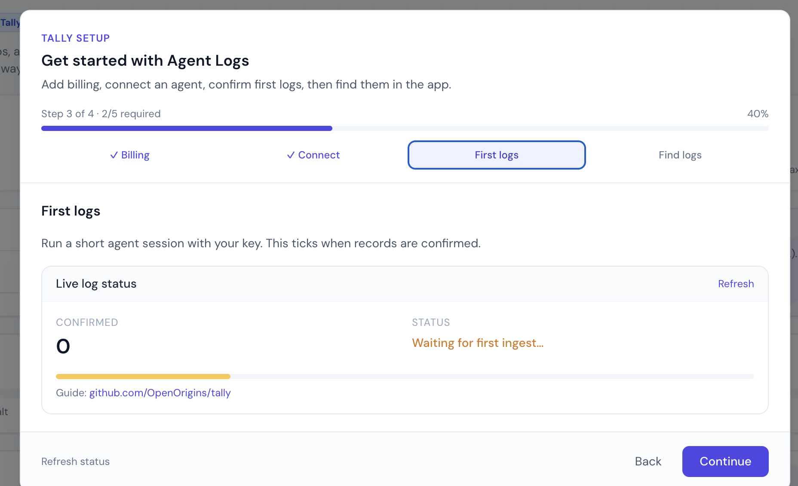

Generate logs by:

1. Opening your connected AI client.
2. Running a short interaction.
3. Returning to the dashboard.
4. Clicking **Refresh**.

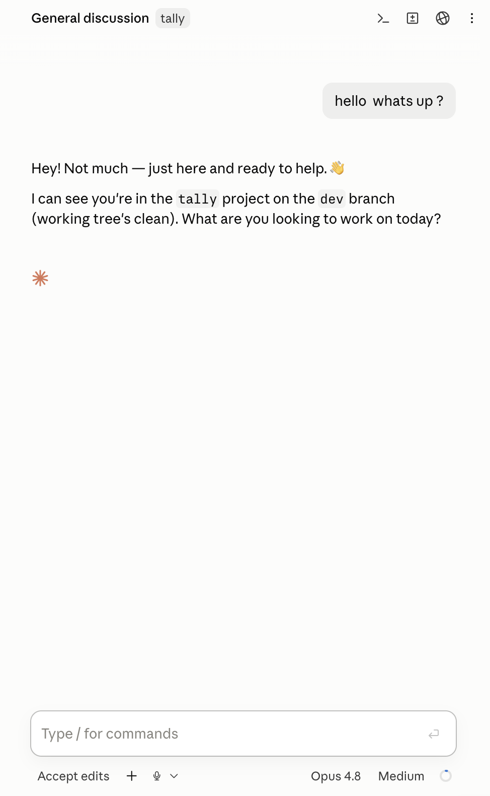

When logs arrive, the status changes to:

```
First logs received
```

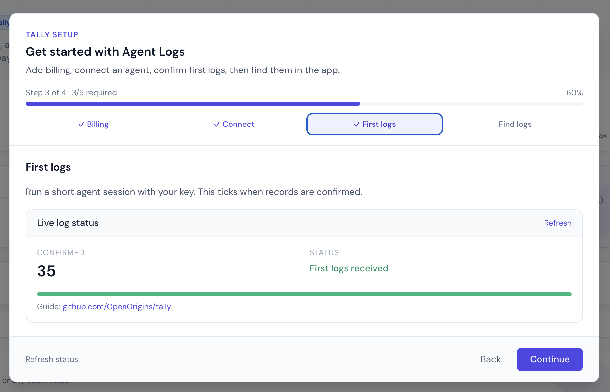

The confirmed log count increases above zero and the step completes automatically.

If you encounter issues, refer to the OpenOrigins Tally GitHub repository.

---

# Step 8 – Find Agent Logs

The final onboarding step explains where your logs are located.

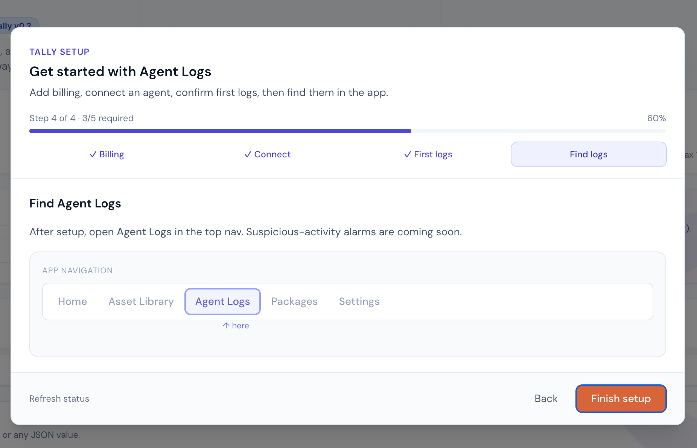

Navigate to:

```
Agent Logs
```

from the top navigation bar.

You will also see a preview of upcoming suspicious activity detection features.

Click:

**Finish setup**

to close the onboarding wizard.

---

# Agent Logs Dashboard

Once onboarding is complete, open the **Agent Logs** page.

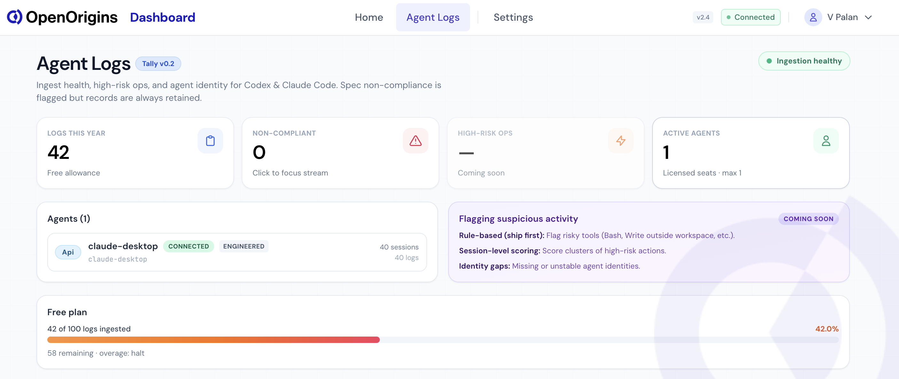


# Setup Complete

Your OpenOrigins account is now fully configured.

Once:

- Billing has been verified
- Your AI client is connected
- The installer handshake succeeds
- Your first logs are ingested

you are ready to monitor AI agent activity through the **Agent Logs** dashboard.

---

# Uninstalling Tally

To remove a Tally integration, open Tally, select the connected client or clients, and select **Uninstall Tally**.

This will:

- Remove Tally hooks from each selected client configuration
- Preserve unrelated client settings
- Delete the locally stored Agent API key and ingest configuration

> **Note**
> Uninstalling only removes the local integration. Your OpenOrigins account and previously ingested logs remain available in the dashboard. New logs are not ingested after the integration is removed.

---
